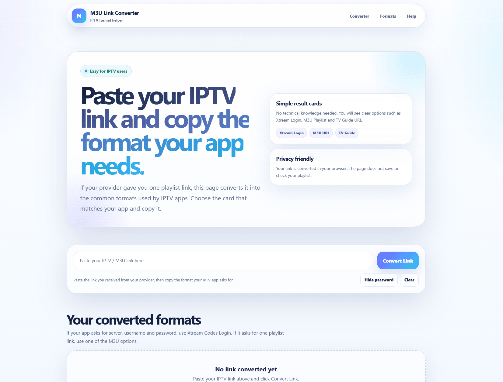

<p align="center">
  
</p>

<br>

# 📺 M3U Link Converter

> A modern, lightweight and privacy-friendly IPTV URL format helper built with plain PHP.

**M3U Link Converter** lets users paste an IPTV / M3U playlist link and instantly copy alternative formats commonly used by IPTV apps, such as **Xtream Codes Login**, **M3U Playlist URL**, **HLS / M3U8**, and **EPG / TV Guide URL**.

No database.  
No API key.  
No server-side playlist checking.  
Just one clean PHP file.

---

## ✨ Features

- 🎯 **Simple IPTV link converter**
  - Paste one IPTV / M3U link
  - Get multiple ready-to-copy formats
  - No technical knowledge required

- 🧩 **Common IPTV formats**
  - Xtream Codes Login
  - M3U Plus MPEG-TS
  - M3U Plus HLS / M3U8
  - Basic M3U MPEG-TS
  - EPG / XMLTV guide URL
  - Alternative playlist path format
  - Player API link

- 🔍 **Smart URL detection**
  - Detects common provider URL styles
  - Extracts server, username and password when available
  - Shows clear result cards for users

- 🧊 **Modern glass UI**
  - Light theme
  - Glassmorphism cards
  - Responsive layout
  - Mobile-friendly design
  - Built-in favicon and logo

- 🔐 **Privacy-friendly**
  - URL conversion runs in the browser
  - No playlist data is stored
  - No database connection required
  - No server-side validation or fetching

- ⚡ **Easy deployment**
  - Single PHP file
  - Upload and run
  - Works on standard PHP hosting

---

## 🚀 Demo Flow

1. User pastes an IPTV / M3U link.
2. The page detects available account details.
3. Converted formats are shown as easy-to-understand cards.
4. User copies the format required by their IPTV app.

Example input:

```text
http://example.com:8080/get.php?username=user123&password=pass123&type=m3u_plus&output=ts
```

Example output cards:

```text
Xtream Codes Login
Server URL: http://example.com:8080
Username: user123
Password: pass123
```

```text
M3U Plus - MPEG-TS
http://example.com:8080/get.php?username=user123&password=pass123&type=m3u_plus&output=ts
```

```text
EPG / TV Guide URL
http://example.com:8080/xmltv.php?username=user123&password=pass123
```

---

## 🧠 Supported Input Types

The converter can detect and process common IPTV URL formats:

| Input Type | Example Pattern |
|---|---|
| Xtream M3U URL | `/get.php?username=...&password=...` |
| Playlist path URL | `/playlist/username/password/m3u_plus` |
| Player API URL | `/player_api.php?username=...&password=...` |
| XMLTV / EPG URL | `/xmltv.php?username=...&password=...` |
| Direct stream URL | `/live/username/password/12345.ts` |
| Portal-style URL | detected as limited conversion |
| Direct `.m3u` / `.m3u8` file | detected as limited conversion |

---

## 📦 Installation

Clone the repository:

```bash
git clone https://github.com/your-username/m3u-link-converter.git
```

Upload the PHP file to your hosting:

```text
public_html/index.php
```

Open it in your browser:

```text
https://your-domain.com/
```

That is all.

---

## 🛠 Requirements

- PHP 7.4 or newer
- Standard web hosting
- No database required
- No Composer required
- No external API required

---

## 🖥️ Usage

Upload the file as:

```text
index.php
```

Then visit the page and paste your IPTV link.

The tool will show converted options such as:

- **Xtream Codes Login**  
  Best when an app asks for Server URL, Username and Password.

- **M3U Plus - MPEG-TS**  
  Good default playlist format for many IPTV apps.

- **M3U Plus - HLS / M3U8**  
  Useful for apps or devices that prefer HLS playback.

- **EPG / TV Guide URL**  
  Used when the app asks for a separate TV guide link.

---

## 🔐 Privacy

This project is designed to be privacy-friendly.

The page does not:

- store playlist URLs
- save usernames or passwords
- connect to a database
- validate IPTV accounts
- fetch playlist contents from the server
- provide IPTV content

The conversion logic runs in the visitor's browser.

---

## ⚠️ Legal Notice

This project does **not** provide IPTV channels, playlists, streams, subscriptions or copyrighted content.

It only reformats IPTV links that users already have.

Use this tool only with playlists and IPTV services you are authorized to access.

---

## 🎨 Design

The interface uses a modern light glassmorphism style:

- soft gradients
- frosted glass panels
- responsive cards
- clean typography
- mobile-friendly layout
- embedded SVG favicon and logo

---

## 📁 Project Structure

```text
m3u-link-converter/
├── index.php
└── README.md
```

---

## 💡 Repository Name Ideas

Recommended:

```text
m3u-link-converter
```

Other possible names:

```text
iptv-m3u-converter
m3u-format-helper
iptv-url-converter
xtream-m3u-converter
```

---

## 📝 Suggested GitHub Description

```text
A modern single-file PHP IPTV M3U link converter with browser-side format detection, glass UI and copy-ready Xtream, M3U, HLS and EPG outputs.
```

Shorter version:

```text
Modern single-file PHP tool to convert IPTV M3U links into Xtream, M3U, HLS and EPG formats.
```

---

## 🤝 Contributing

Contributions are welcome.

Ideas for future improvements:

- 🌍 multi-language support
- 📱 QR code generation
- 🎛 app-specific result filtering
- 📋 more IPTV app presets
- 🌙 optional dark theme
- 🔗 shareable converted result view without storing sensitive data

---

## 📄 License

MIT License

You are free to use, modify and distribute this project.
